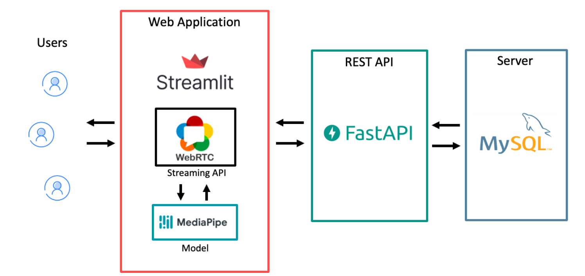
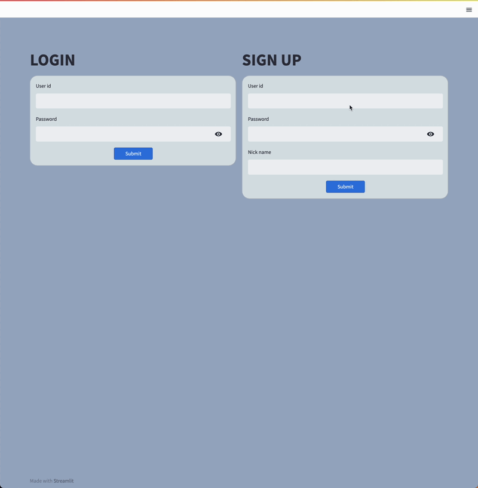
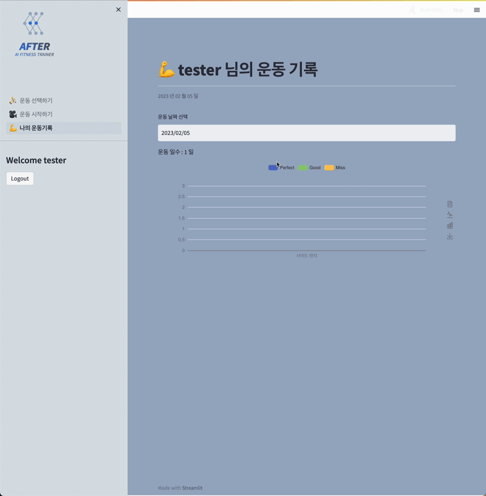

# AFTER(AI FITNESS TRAINER) 


<p align="left" display="inline-block">
    
    
    
    
    
    
      


## 👨‍👩‍👧‍👧Team

<div align="left">
  <table>
    <tr>
      <td align="center">
        <a href="https://github.com/DHKim95/">
          
        </a>
      </td>
      <td align="center">
        <a href="https://github.com/won-joon">
          
        </a>
      </td>
      <td align="center">
        <a href="https://github.com/SS-hj">
          
        </a>
      </td>
      <td align="center">
        <a href="https://github.com/soonyoung-hwang">
          
        </a>
      </td>
    </tr>
    <tr>
      <td align="center">
        <a href="https://github.com/DHKim95/">
          김도훈
        </a>
      </td>
      <td align="center">
        <a href="https://github.com/won-joon">
          서원준
        </a>
      </td>
      <td align="center">
        <a href="https://github.com/SS-hj">
          이하정
        </a>
      </td>
      <td align="center">
        <a href="https://github.com/soonyoung-hwang">
          황순영
        </a>
      </td>
    </tr>
  </table>
</div>


## 📃프로젝트 소개

코로나19와 유튜브의 보급으로 홈트레이닝에 대한 수요가 늘어나고 있습니다. 저희는 헬스 초보자도 올바른 자세로 운동을 할 수 있도록 도와주는 서비스를 제공하고자 합니다. AFTER는 사용자의 운동자세를 보고 실시간으로 동작에 대한 점수를 분류함으로써 올바른 운동자세로 운동할 수 있도록 도움을 줍니다. 그것을 가능하게 하기 위해 **Pose Estimation**을 이용해 특징점을 잡아내고 올바른 운동자세로 했을 때의 특징점과 유사도를 분석하고 정확한 동작인지 판별하게 됩니다.


### 🔧  Service Architecture

------

<p align="center"></p>


### 🔨 개발환경

------

- GPU : Tesla V100

- OS : Ubuntu 18.04.5 LTS
- CPU : Intel(R) Xeon(R) Gold 5120 CPU @ 2.20GHz
- Python : 3.8.5
- MySQL : 5.7.40-0ubuntu0.18.04.1


### ⚙ 주요 라이브러리

------

- Streamlit : `1.16.0`
- Fastapi : `0.68.1`
- Mediapipe : `0.8.9.1`
- Streamlit-WebRtc : `0.44.2`


### 📁 Directory Structure

------

```
📦final-project-level3-cv-15
┣ 📂app
┃ ┣ 📂img
┃ ┃ ┣ 📜good.png
┃ ┃ ┣ 📜miss.png
┃ ┃ ┗ 📜perfect.png
┃ ┣ 📂pages
┃ ┃ ┣ 📜2_⛹_운동_선택하기.py
┃ ┃ ┣ 📜3_🎥 _운동_시작하기.py
┃ ┃ ┗ 📜4_💪 _나의_운동기록.py
┃ ┣ 📜backend.py
┃ ┣ 📜database.py
┃ ┣ 📜frontend.py
┃ ┣ 📜localstorage.py
┃ ┣ 📜requirements.txt
┃ ┗ 📜style.css
┣ 📜.gitignore
┗ 📜README.md
```


### ⚔ 실행방법

```bash
conda create -n [가상환경이름] python=3.8

conda activate [가상환경이름]
cd final-project-level3-cv-15

pip install -r requirements.txt

python backend.py

streamlit run frontend.py --server.port [서버포트] --server.fileWatcherType none
```


## 🎞 Demo

- 회원가입 및 로그인

  <p align="center"></p>

- 운동 가이드 및 선택

  <p align="center"></p>

- 운동 화면

  <p align="center"></p>

- 나의 운동 기록

  <p align="center"></p>


